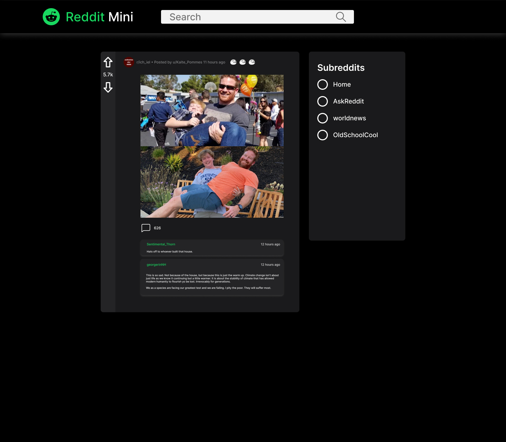

# Reddit Mini
> This is a mini version of Reddit built using React, Redux, and TailwindCSS
> Live demo [_here_](https://www.example.com). <!-- If you have the project hosted somewhere, include the link here. -->

## Table of Contents
* [General Info](#general-information)
* [Technologies Used](#technologies-used)
* [Features](#features)
* [Screenshots](#screenshots)
* [Setup](#setup)
* [Usage](#usage)
* [Project Status](#project-status)
* [Room for Improvement](#room-for-improvement)
* [Acknowledgements](#acknowledgements)
* [Contact](#contact)
<!-- * [License](#license) -->

## General Information
- The purpose of the Project is to deepen my React & Redux knowlegen, and understand better how Redux manages state.
- I've built this project to prove to myself that I understood the concepts learnt so far inside the Codecademy Full Stack Career Path. And I want to apply as much as I can from what Codecademy has taught me.
<!-- You don't have to answer all the questions - just the ones relevant to your project. -->

## Technologies Used
- React - version ^18.2.0
- Redux - version ^4.2.0
- Tailwind CSS - version 3.1.3
- Jest & Enzyme

## Features
- Desktop and Mobile responsive
- Search funtionality
- Filter Data (by selecting sub reddits)
- 

## Screenshots

<!-- If you have screenshots you'd like to share, include them here. -->

## Setup
<!-- What are the project requirements/dependencies? Where are they listed? A requirements.txt or a Pipfile.lock file perhaps? Where is it located?

Proceed to describe how to install / setup one's local environment / get started with the project. -->

Run `npm install` to install all the dependencies

### Available Scripts

In the project directory, you can run:

### `npm start`

Runs the app in the development mode.\
Open [http://localhost:3000](http://localhost:3000) to view it in your browser.

The page will reload when you make changes.\
You may also see any lint errors in the console.

### `npm run build`

Builds the app for production to the `build` folder.\
It correctly bundles React in production mode and optimizes the build for the best performance.

The build is minified and the filenames include the hashes.\
Your app is ready to be deployed!

### `npm run eject`

**Note: this is a one-way operation. Once you `eject`, you can't go back!**

If you aren't satisfied with the build tool and configuration choices, you can `eject` at any time. This command will remove the single build dependency from your project.

Instead, it will copy all the configuration files and the transitive dependencies (webpack, Babel, ESLint, etc) right into your project so you have full control over them. All of the commands except `eject` will still work, but they will point to the copied scripts so you can tweak them. At this point you're on your own.

You don't have to ever use `eject`. The curated feature set is suitable for small and middle deployments, and you shouldn't feel obligated to use this feature. However we understand that this tool wouldn't be useful if you couldn't customize it when you are ready for it.

## Project Status
Project is: _in progress_ 
<!-- / _complete_ / _no longer being worked on_ . If you are no longer working on it, provide reasons why. -->

## Room for Improvement
Include areas you believe need improvement / could be improved. Also add TODOs for future development.

Room for improvement:
- Improvement to be done 1
- Improvement to be done 2

To do:
- Feature to be added 1
- Feature to be added 2

## Acknowledgements
Give credit here.
- This project was inspired by Codecademy Full Stack Career Path
- This project was based on [this tutorial](https://www.example.com).
- Many thanks to...

## Contact
Created by [@tonyspunei](https://www.linkedin.com/in/tony-spunei-6a3378211/) - feel free to contact me!

<!-- Optional -->
<!-- ## License -->
<!-- This project is open source and available under the [... License](). -->

<!-- You don't have to include all sections - just the one's relevant to your project -->